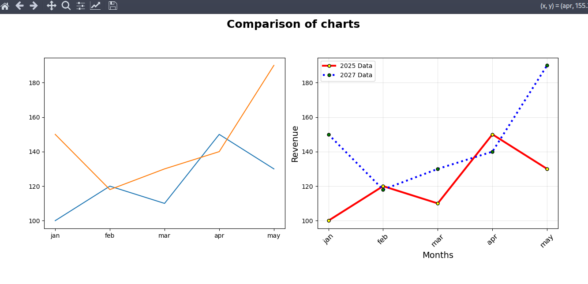

# 📊 Matplotlib Chart Customization Comparison

A beginner-friendly Python project demonstrating the difference between a default Matplotlib line chart and a professionally customized chart. This project covers figure customization, line styling, markers, legends, gridlines, axis labels, subplot layouts, and overall chart presentation.

---

## 📌 Project Objective

The goal of this project is to learn how various Matplotlib customization options improve the readability and appearance of charts.

The project compares:

- A default line chart
- A fully customized line chart

to understand how visualization techniques make data easier to interpret.

---

## 📂 Project Structure

```text
Matplotlib-Chart-Customization/
│
├── custom_chart.py
├── screenshots/
│   └── comparison_chart.png
└── README.md
```

---

## 📈 Dataset

The project uses a small sample dataset representing monthly revenue for two different years.

| Month | Revenue (2025) | Revenue (2027) |
|-------|---------------:|---------------:|
| Jan | 100 | 150 |
| Feb | 120 | 118 |
| Mar | 110 | 130 |
| Apr | 150 | 140 |
| May | 130 | 190 |

---

## 🛠️ Technologies Used

- Python
- Matplotlib

---

## 📚 Concepts Covered

### Figure Customization

- Figure size (`figsize`)
- DPI (`dpi`)
- Overall figure title (`suptitle`)

### Subplots

- Creating multiple charts
- `subplot()`
- Comparing visualizations

### Line Customization

- Line color
- Line width (`lw`)
- Line style (`linestyle`)
- Multiple lines on one graph

### Marker Customization

- Marker style (`marker`)
- Marker size (`markersize`)
- Marker face color (`markerfacecolor`)
- Marker edge color (`markeredgecolor`)

### Axis Formatting

- X-axis labels
- Y-axis labels
- Tick rotation
- Font size

### Chart Enhancement

- Gridlines
- Legends
- Layout adjustment using `tight_layout()`

---

## 📊 Output

The program generates two charts side by side.

### Left Chart

A default Matplotlib line chart with no customization.

### Right Chart

A professionally styled line chart featuring:

- Custom colors
- Different line styles
- Styled markers
- Axis labels
- Grid
- Legend
- Rotated month labels
- Figure title

This comparison clearly demonstrates how visualization customization improves chart readability.

---

## 🚀 How to Run

1. Clone the repository.

```bash
git clone <repository-url>
```

2. Navigate to the project folder.

```bash
cd Matplotlib-Chart-Customization
```

3. Install Matplotlib (if not already installed).

```bash
pip install matplotlib
```

4. Run the Python file.

```bash
python chart_customization.py
```

---

## 🎯 Learning Outcomes

After completing this project, you will understand how to:

- Create multiple subplots
- Customize figure size and DPI
- Style line charts
- Use different markers
- Customize line colors and widths
- Add legends
- Add gridlines
- Rotate tick labels
- Improve chart presentation
- Build professional-looking visualizations with Matplotlib

---

## 📷 Sample Output


```
screenshots/comparison_chart.png
```


`

---

## 🔮 Future Improvements

- Add bar chart customization
- Add scatter plot customization
- Add histogram styling
- Apply Matplotlib themes
- Use custom color palettes
- Save charts as high-resolution images
- Compare multiple chart types in one figure

---

## 👨‍💻 Author

**Subir Sutradhar**

